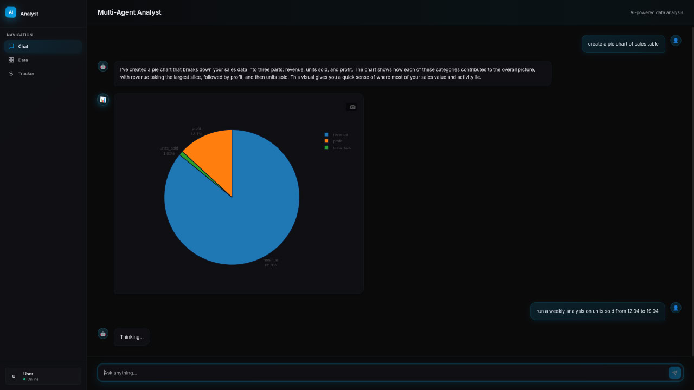
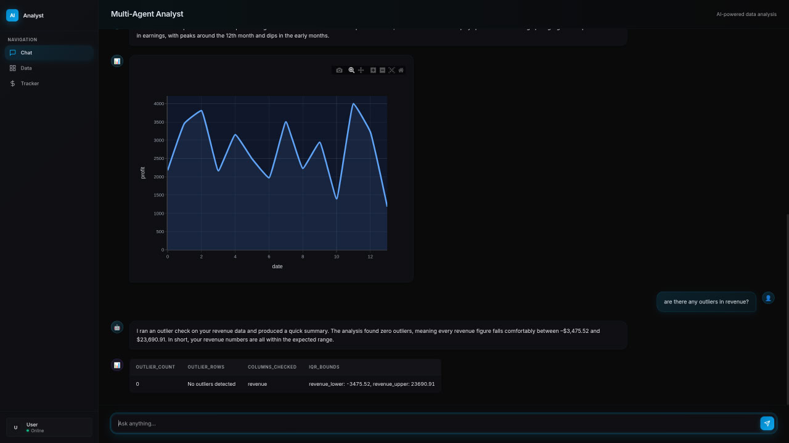
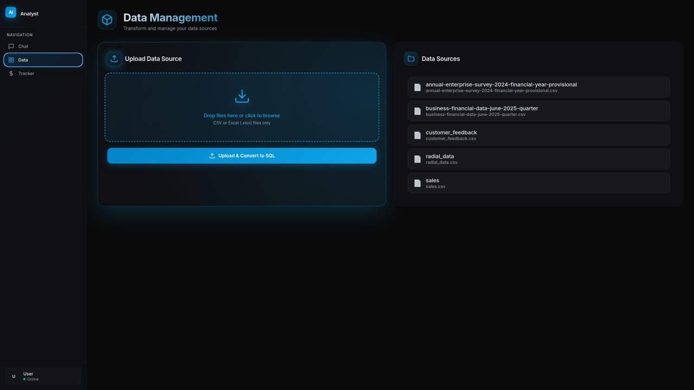

# **🧠 Multi-Agent Analyst**

### **Autonomous Data Analysis & Orchestration System**

**Upload Data → Agents Plan → Agents Execute → Self-Heal → Deliver Insights.**

## **🚀 Overview**

**Multi-Agent Analyst** is a next-generation data intelligence platform powered by an autonomous orchestration engine. Unlike traditional analysis tools that require constant human guidance, this system employs a swarm of specialized AI agents capable of planning complex workflows, executing SQL queries, generating statistical models, and visualizing results.

The system's defining feature is its **Self-Healing Execution Loop**. If a step fails—whether due to a missing column, syntax error, or data type mismatch—the Resolver Agent intercepts the error, diagnoses the root cause, patches the instruction, and re-executes the workflow autonomously.

### **🔬 Technical Highlights**

* **Hybrid Neuro-Symbolic Architecture:** Combines the deterministic stability of **Graph-based orchestration** (StateGraph) with the adaptive flexibility of **ReAct (Reasoning \+ Acting)** agents. This ensures high-level plan adherence while allowing individual agents to dynamically reason through unforeseen data anomalies at the node level.  
* **Deterministic DAG Planning:** The Planner Agent constructs a Directed Acyclic Graph (DAG) for every request, ensuring logical dependency resolution and enabling parallel task execution.  
* **Context-Aware SQL Generation:** Dynamically maps unstructured CSV/XLSX uploads to strict SQL types, handling schema inference and index optimization on the fly.  
* **Event-Driven Architecture:** Built on a non-blocking asyncio event loop with FastAPI, utilizing WebSockets for real-time agent thought streaming to the frontend.  
* **Sandboxed Execution:** Each analysis session runs in an isolated PostgreSQL schema container, preventing data leakage and ensuring thread-safe operations.

## 📸 Interface

  
  

  

    
    
  

## **✨ Key Capabilities**

### **🤖 Autonomous Multi-Agent Swarm**

A hierarchical agent architecture ensures tasks are handled by specialists:

* **Planner Agent:** Deconstructs user intent into a Directed Acyclic Graph (DAG) of executable steps.  
* **Controller Agent:** The central brain that orchestrates execution and manages state.  
* **Data Agent:** Handles SQL generation, schema introspection, and complex querying.  
* **Analysis Agent:** Performs statistical aggregation, regression, and ML computations.  
* **Visualization Agent:** Generates publication-ready charts with auto-scaling layouts.

### **🔁 Self-Healing Execution Engine**

The system possesses "resilience by design."

1. **Detection:** Execution failures are caught in real-time.  
2. **Diagnosis:** The **Resolver Agent** analyzes the stack trace and the agent's previous context.  
3. **Correction:** A corrected parameter set or logic path is generated.  
4. **Recovery:** The Controller rewinds execution to the failed step and applies the fix.

### **📂 Dynamic Data Ingestion Pipeline**

* **Zero-Config Upload:** Instant parsing of CSV/XLSX files.  
* **Auto-Schema Inference:** Intelligent detection of data types and relations.  
* **Sandboxed Environments:** Per-thread PostgreSQL schemas prevent data collision.  
* **Object Storage:** Redis-backed intermediate state storage for high-speed agent communication.

## **🏗 System Architecture**

The system utilizes a **Graph-Controlled ReAct Pattern**. The Controller enforces the global state machine (the Graph), while individual agents utilize the ReAct loop (Thought → Action → Observation) to solve specific tasks adaptively within that structure.

       ┌──────────────────────────────┐  
       │ 👤 User Request              │  
       └─────┬────────────────────────┘  
             │  
             ▼   
       ┌──────────────────────────────┐  
       │ 🎯 Intent Classifier         │  
       └─────┬────────────────────────┘  
             │ "Goal"  
             ▼  
       ┌──────────────────────────────┐  
       │ 💡 Planner Agent             │   
       └─────┬────────────────────────┘  
             │ "Execution Plan (DAG)"  
             ▼  
       ┌──────────────────────────────┐  
       │ ⚙️ Controller Agent          │   
       │      (Orchestration Engine)  │  
       ├─────┬──────────────────────┬─┤  
       │ S1  │ S2                   │ On Error  
       │     ▼                      ▼  
       │ 💾 DataAgent   📊 VisAgent   
       │     │                      │ "Error"  
       │     ▼ "Success"            ▼   
       │ ⚙️ Controller Agent 🛡️ Resolver Agent  
       │     ▲                      │ "Diagnose & Patch"  
       │     └─────── "Retry" ──────┘  
       └─────┬────────────────────────┘  
             │ "Aggregated Results"  
             ▼  
       ┌──────────────────────────────┐  
       │ 📝 Summarizer                │  
       └─────┬────────────────────────┘  
             │  
             ▼  
       ┌──────────────────────────────┐  
       │ ✅ Final Report & Charts     │  
       └──────────────────────────────┘

## **🧠 Workflow Example**

**User:** *"Create a line plot showing the trend of profit margins over the last 4 quarters."*

1. **Ingestion:** User uploads sales\_Q1\_Q4.csv. System infers schema and creates SQL table thread\_123.sales.  
2. **Planning:** Planner creates a 3-step plan: (1) Query Data, (2) Calculate Margin, (3) Plot Data.  
3. **Execution:** \- *Data Agent* executes SQL.  
   * *Visualization Agent* fails: KeyError: 'date'.  
4. **Resolution:** \- *Resolver Agent* inspects schema, realizes the column is named transaction\_date, not date.  
   * Updates the step parameters.  
5. **Success:** Controller re-runs the visualization step. A clean line chart is returned to the UI.

## **🛠 Technology Stack**

### **Backend & Orchestration**

* **Core:** Python 3.10+, FastAPI (Async)  
* **Orchestration:** Custom LangGraph-style State Machines  
* **LLM Integration:** OpenAI API / Ollama (Pluggable Local Models)  
* **Data Processing:** Pandas, NumPy, SQLAlchemy

### **Data Infrastructure**

* **Database:** PostgreSQL (with dynamic schema generation)  
* **Caching & State:** Redis  
* **Storage:** MinIO / Local Object Store

### **Frontend Experience**

* **UI:** High-performance HTML5/CSS3 (Ambient Glow Design System)  
* **Interactivity:** Vanilla JS (ES6+) for minimal latency  
* **Visualization:** Matplotlib, Base64 Stream Rendering

## **🗺 Roadmap**

* \[x\] **MVP Core:** Planning, Execution, Self-Repair, SQL Ingestion.  
* \[ \] **Predictive Module:** Forecasting, Clustering, and Anomaly Detection agents.  
* \[ \] **Model Training:** Allow agents to train lightweight SKLearn models on uploaded data.  
* \[ \] **Plugin System:** Hot-swappable tools for external API integration.  
* \[ \] **Visual Trace UI:** Interactive graph showing real-time agent decision trees.

## **📄 License**

Distributed under the MIT License. See LICENSE for more information.

• Targeted Release: Jan 2025
